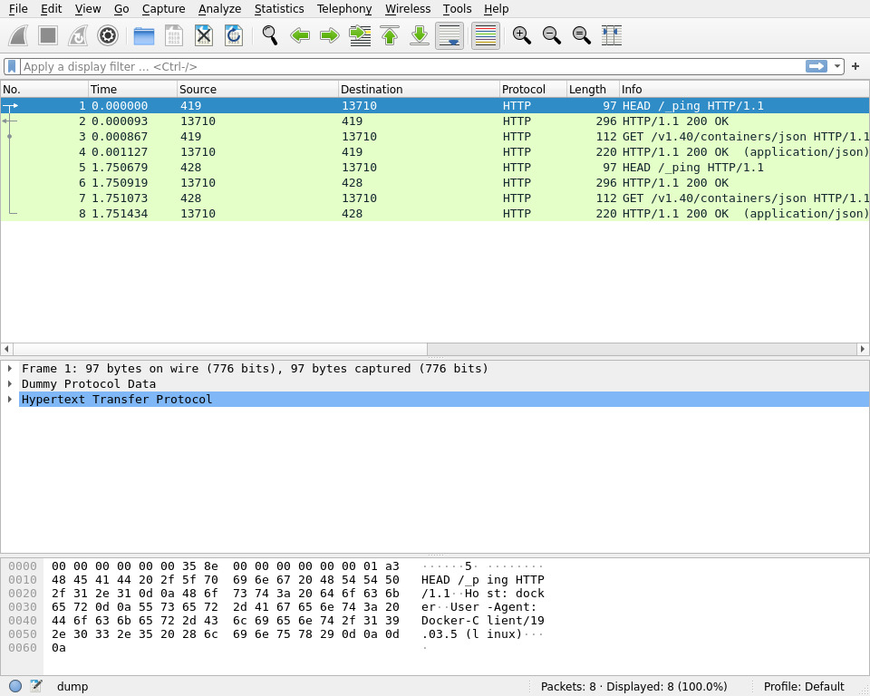

sockdump
========

Dump unix domain socket traffic.

Requirement
-----------

- bcc

Example
-------

```
$ sudo ./sockdump.py /var/run/docker.sock # run "docker ps" in another terminal
>>> docker[3412] len 83
GET /_ping HTTP/1.1
Host: docker
User-Agent: Docker-Client/18.06.1-ce (linux)

>>> dockerd[370] len 215
HTTP/1.1 200 OK
Api-Version: 1.38
Docker-Experimental: false
Ostype: linux
Server: Docker/18.06.1-ce (linux)
Date: Tue, 25 Sep 2018 07:05:03 GMT
Content-Length: 2
Content-Type: text/plain; charset=utf-8

OK>>> docker[3412] len 99
GET /v1.38/containers/json HTTP/1.1
Host: docker
User-Agent: Docker-Client/18.06.1-ce (linux)

>>> dockerd[370] len 207
HTTP/1.1 200 OK
Api-Version: 1.38
Content-Type: application/json
Docker-Experimental: false
Ostype: linux
Server: Docker/18.06.1-ce (linux)
Date: Tue, 25 Sep 2018 07:05:03 GMT
Content-Length: 3

[]
```

```
$ sudo ./sockdump.py /var/run/docker.sock --format pcap --output dump
^C
16 packets captured
$ wireshark-gtk -X lua_script:wireshark/dummy.lua dump
```


Limitations
-----------

```
$ grep FIXME: sockdump.py 
# FIXME: sock path is relative
# FIXME: optimize filter
```
